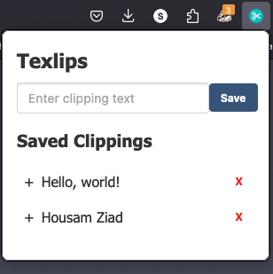
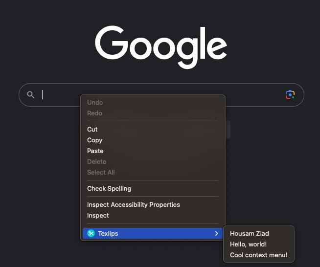

# Texlips (Text Clips) Chrome / Firefox Extension

Texlips is a simple Chrome / Firefox Extension that allows you to save and manage text clippings for easy access and reuse. With Texlips, you can quickly save snippets of text and insert them into input fields or text areas with a single click. Say goodbye to repetitive typing and hello to productivity!

## Features

- **Save Clippings**: Easily save text clippings for later use.
- **Insert with Context Menu**: Insert saved clippings into input fields and text areas directly from the context menu.
- **Delete Clippings**: Remove clippings you no longer need.
- **No Duplicate Clippings**: Texlips ensures that you don't save duplicate clippings.

## Installation

1. Download the extension files or clone this repository.
2. Open Chrome and go to `chrome://extensions/`.
3. Enable "Developer mode" in the top right corner.
4. Click on "Load unpacked" and select the extension directory.

## Usage

1. Right-click on an input field or text area.
2. In the context menu, select "Texlips" to see your saved clippings.
3. Click on a clipping to insert it into the field.

To save a new clipping:

1. Type your text in the "Enter clipping text" input field.
2. Click the "Save" button.

To delete a clipping:

1. In the popup menu, locate the clipping you want to delete.
2. Click the "Delete" button next to the clipping.

## Screenshots

## Contributing

Contributions are welcome! If you have any feature suggestions or find any issues, please open an issue or submit a pull request.

## License

This project is licensed under the MIT License - see the [LICENSE](LICENSE) file for details.

## Acknowledgments

- Extension icon made by [iconpacks](https://www.iconpacks.net/free-icon/scissors-5845.html).
